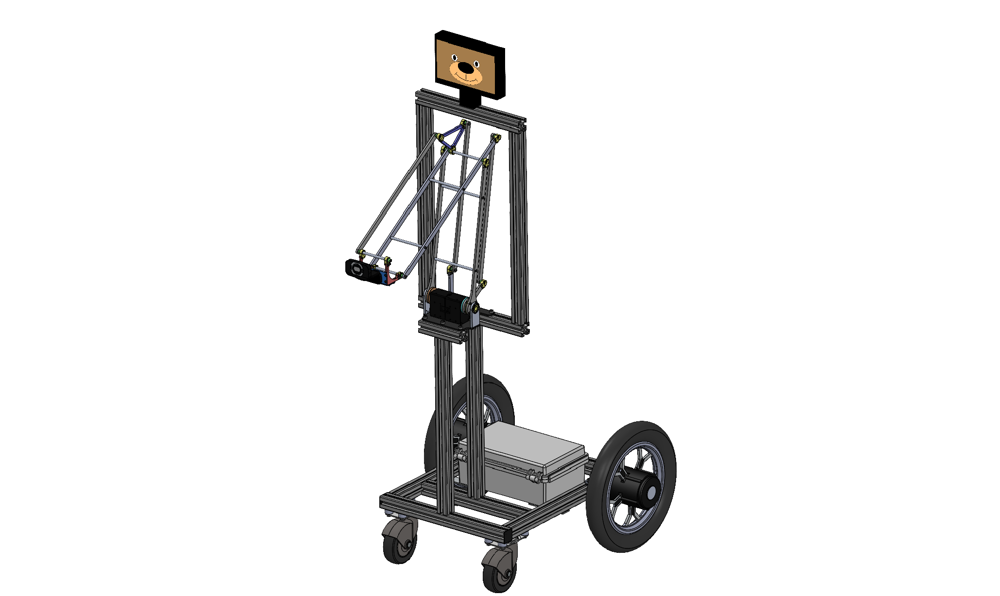
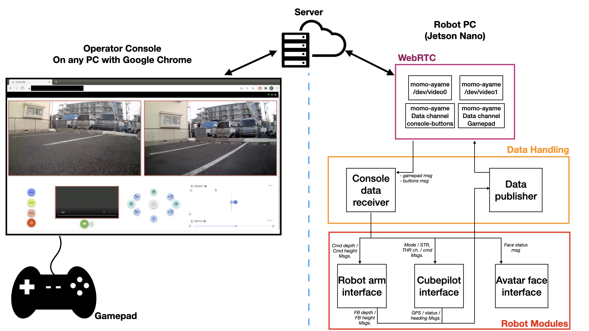

# AvatarBot

This is a proof-of-concept for the avatar robot that user can control and view the video stream over the internet.

All of these codes would be on the robot side which can be Jetson Nano or Xavier. The console side is made by [Cielo Jordan](https://github.com/cieloginzafarm) by using momo-ayame WebRTC, for more detail please check on her github repo and [momo](https://github.com/shiguredo/momo).

## Dependencies

- momo binary file from [here](https://github.com/shiguredo/momo/releases)
- Dynamixel SDK for controlling ROBOTIS servos [here](https://emanual.robotis.com/docs/en/software/dynamixel/dynamixel_sdk/overview/)
- dronekit python module `pip install dronekit` , `pip install pymavlink`
- python opencv for avatar faces, I didn't attach the face images here, but you can use any image you want, pleass check on `avatar-face-interface.py`
- socat to open /dev/pts/* ports for momo data channels, install by `sudo apt-get install socat` 

## Run 

You will need to run `sh 01_socat.sh` to start socat at first. Then you will need to run four channels of momo for two cameras channel and console buttons data channel, and gamepad data channel.

`console-data-receiver.py` is taking care of data coming on /dev/pts/* port which will be console buttons data and gamepad data. It would arrange the data to proper format and send it to another process by UDP socket. 
**Note** We will get gamepad data when it got pressed or being pressed only. We got data piling issues before when gamepad data is continuously sent all the time, and that caused unexpected movement on the rover.

`cubepilot-interface.py` is taking care of all the cube pilot stuff. It will send data of gps to `data-publisher.py` to make it publish current position back to the server and show on screen.

`robot-arm-interface.py` is taking care of arm movement and send the feedback of servo back to `data-publisher.py` too to update the slider on browser. Because some user input value cannot make the robot move.

`avatar-face-interface.py` is taking care of switching the face on display according to user buttons / arm-disarm / steering values.

`data-publisher.py` is taking care of getting data from each process and publish necessary data back to the console.

You have to run all of these scripts to make it fully functional.

